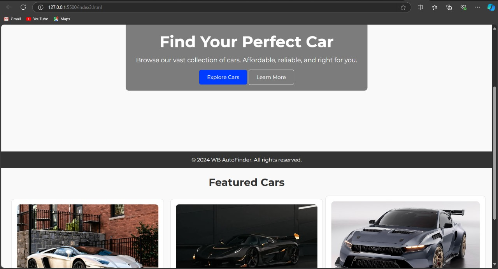

## AutoFinder - Car Sales Website

Overview
AutoFinder is a front-end interactive car sales website designed to make browsing, viewing, and booking test drives for cars as seamless as possible. This project is built using HTML, CSS, and JavaScript, focusing on user experience and interactivity. The website allows users to explore car inventories, view detailed information for specific cars, schedule test drives, and get in touch with the dealership.

## Screenshot

Website Features:

1. Landing Page:

A visually appealing and user-friendly introduction to the dealership.

A carousel displaying featured cars.

Easy navigation to inventory, test drive booking, and contact pages.

2. Cars Inventory Page:

Displays a list of available cars with images, prices, and “View Details” buttons.

Each car has a dedicated page showing its detailed specifications.

3. Test Drive Booking Page:

A form for users to schedule test drives for specific cars.

Includes various input fields like text boxes, dropdowns, radio buttons, date pickers, etc.

4. About Us Page:

Provides information about the dealership, its mission, and its commitment to customer satisfaction.

5. Contact Us Page:

A form that allows users to submit inquiries, including an option to upload attachments.

Technologies Used:

HTML5: For page structure and content layout.

CSS3: For styling and responsive design across various devices.

JavaScript: For interactivity, form validation, and dynamic content handling.

---

Pages Overview:

index.html: The landing page with a hero section, featured cars, and navigation links.

inventory.html: Displays a list of cars with options to view details for each.

car-details.html: Dedicated car details pages providing full specifications.

test-drive.html: A form to book test drives for available cars.

about.html: An informational page about the dealership.

contact.html: A contact form for inquiries.

Navigate the Website:

1. Landing Page: Explore the car inventory or book a test drive using the navigation links.

2. Inventory: Browse the available cars, and click on "View Details" to see individual car specifications.

3. Book a Test Drive: Fill out the form on the Test Drive page to schedule a test drive.

4. Contact Us: Use the contact form to send inquiries or requests to the dealership.

Form Elements:

Test Drive Form: This form collects the user's full name, email, phone number, car model, and preferred test drive date and time.

Contact Form: Allows users to send a message to the dealership with an optional file upload.
